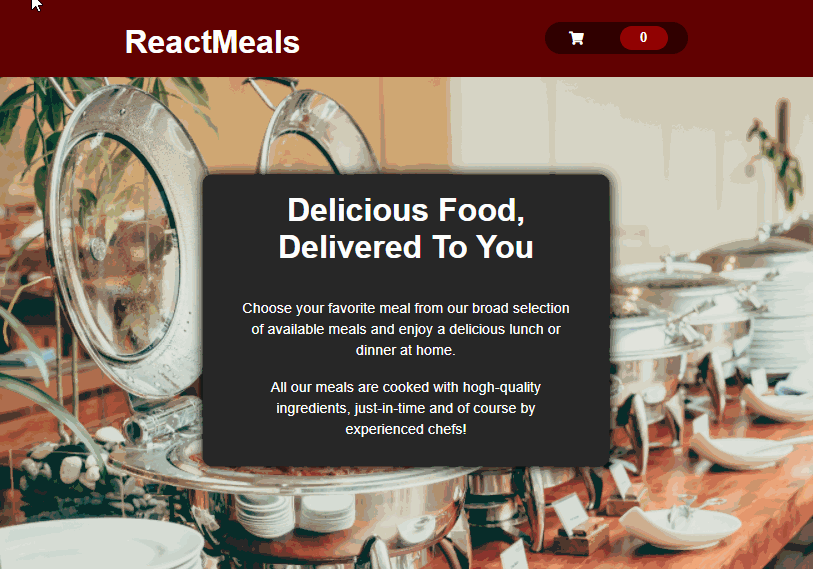
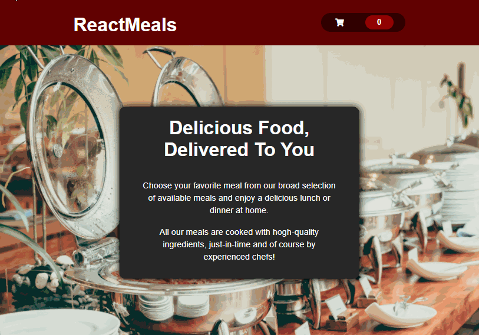

# Sistema para pedidos de refeições

## 💻 Objetivo

Esse projeto objetiva fornecer um sistema SPA (*Single Page Application*) eficiente para a realização de pedidos por parte dos usuários.

## ⚙️ Funcionalidades

1. Fornecer uma lista de refeições para os usuários a partir de um banco de dados do `Firebase`;
2. Fornecer um carrinho de compras para armazenar as refeições selecionadas pelos usuários; 
3. Armazenar os pedidos realizados pelos usuários no banco de dados do `Firebase`.

## 🎨Layout
### Tela principal

### Carrinho de compras

## 🛠 Tecnologias
- [JavaScript](https://developer.mozilla.org/pt-BR/docs/Web/JavaScript)
- [React](https://reactjs.org/)
- [CSS Modules](https://github.com/css-modules/css-modules)
- [Firebase](https://firebase.google.com/?gclid=CjwKCAjwy42FBhB2EiwAJY0yQrggRsMFApA2pnIGVfKKpscVVxV_rz8N4EDUmSx0P3yo_2MFibtqDhoCVpcQAvD_BwE&gclsrc=aw.ds)

## 🦸 Autor
* Yuri Ribeiro Felipe
* 
* 

